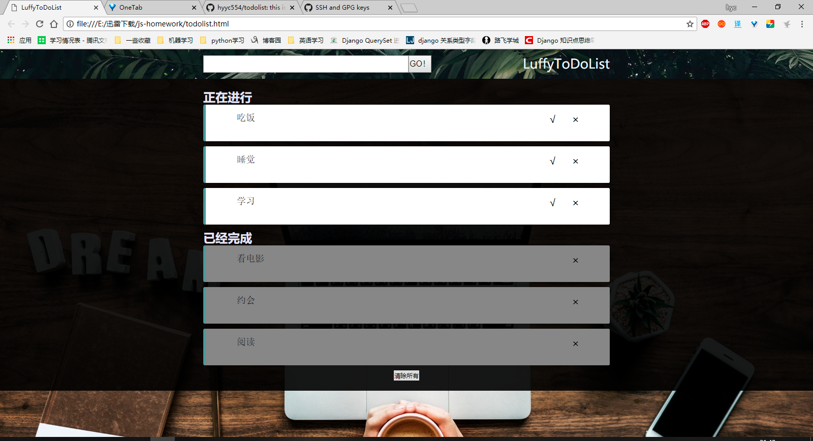

# todolist实现

## 1.目录结构

``````
js-homework\                      ------------------------------项目主目录
    |----css\                     ------------------------------CSS保存目录
    |    |----style.css           ------------------------------todolist的css文件
    |----js\                      ------------------------------JS保存目录
    |    |----javascript.js       ------------------------------todolist的js文件
    |----readme.md                ------------------------------项目说明文件
    |----todolist.html            ------------------------------todolist的html文件

``````

## 2.页面预览



## 3.主要功能

1. 将用户输入添加至待办项
2. 可以对todolist进行分类（待办项和已完成组），用户勾选既将待办项分入已完成组
3. todolist的每一项可删除和编辑
4. 下方有clear按钮，并清空所有todolist项